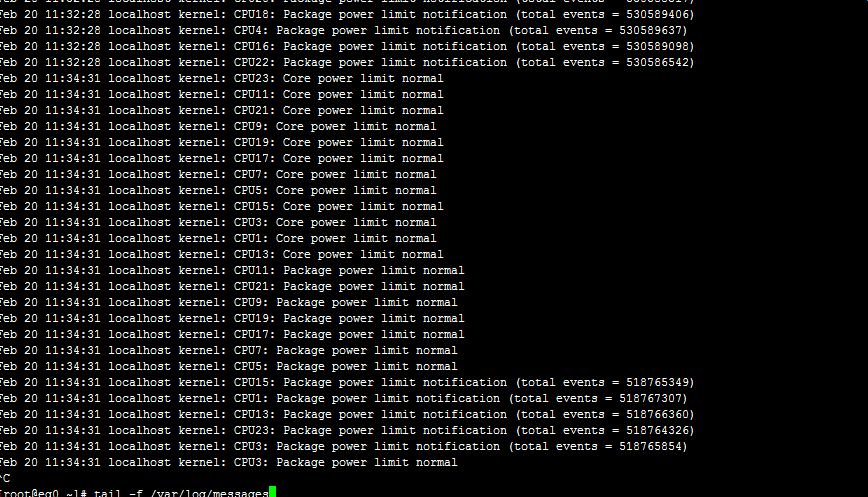

**关键词**：show processlist sql mysql 优化 
## 故障描述：
公司搭建了一个新jenkins持续集成环境，在新的jenkins构建job比原来的jenkins慢5-10倍左右的时间，老jenkins构建一个job需要50秒，新jenkins构建需要5分钟，而且新的jenkins服务机器比老jenkins服务器性能更好。遭到开发人员和测试人员强烈吐槽。
## 原因分析：
原因是服务器是dell机器，在系统初始化的时候，bios设置模式为cpu节能模式，貌似dell的服务器都有这个毛病。通过观察系统日志，只要maven在编译代码的时时候报错“CPU5: Package power limit normal”。解决过程也是比较曲折，花了大量的时间来对比maven的执行过程，打算找到到底哪一步比较慢。
## 解决方案：
重启服务器同时设置bios里的cpu节能模式。最后还是重启大法好！！！
## 参考资料：
http://www.dell.com/support/article/cn/zh/cnbsdt1/SLN266056/linux---%22package-power-limit%22-and-%22core-power-limit%22-notifications?lang=EN
## 解决过程：
1，查看服务器日志 ：tail -f /var/log/messages
Feb 20 11:34:31 localhost kernel: CPU5: Package power limit normal
Feb 20 11:34:31 localhost kernel: CPU15: Package power limit notification (total events = 518765349)

