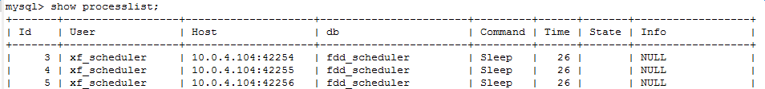
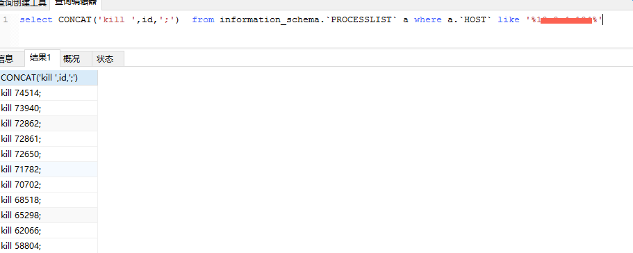

**关键词**：show processlist sql mysql 优化 
~~~
概要：
   SHOW PROCESSLIST显示哪些线程正在运行。如果您有SUPER权限，您可以看到所有线程。否则，您只能看到您自己的线程  
   （也就是，与您正在使用的MySQL账户相关的线程）。如果您不使用FULL关键词，则只显示每个查询的前100个字符。

   本语句报告TCP/IP连接的主机名称（采用host_name:client_port格式），以方便地判定哪个客户端正在做什么。

   如果您得到“too many connections”错误信息，并且想要了解正在发生的情况，本语句是非常有用的。  
   MySQL保留一个额外的连接，让拥有SUPER权限的账户使用，以确保管理员能够随时连接和检查系统  
   （假设您没有把此权限给予所有的用户）。
~~~

**目录**：  
1. [命令用法](#)  
2. [问题处理](#)  
3. [参数解析](#)  
4. [参考资料](#)  

---

###### 1  命令用法
> mysql> show processlist;

---

###### 2  问题处理
~~~
问题描述：公司测试环境要同步线上数据库，线上数据量170G,测试数据量25G。从线上同步数据下来后，系统能够登录，但是非常不稳定而且到处报错，  后台报time out 错误，且执行sql脚本异常缓慢，然后试着重启数据库，但是无效果
原因分析：线上数据库量比较大，特别是一些数据统计定时脚本，在测试环境设置频率很高1分钟一次，在大数据量的情况下，  前面的定时任务在还未处理数据，后面的脚本又开始执行，造成数据库锁表，拖慢整个系统，导致整个系统崩溃无法使用。
解决办法：通过查看数据库连接列表（命令：show processlist），有大量的连接而且在持续飙升，特别是某服务的连接状态一直处于：Sending data 状态，  一直在不停的查询；而且发现连接的ip来自10.0.x.XXX；两台数据库的python定时脚本，都指向数据库服务器，然后尝试注释掉定时脚本（命令:crontab -e）同时停掉统计服务。最后把数据连接的id找出来，  命令：select CONCAT('kill ',id,';')  from information_schema.`PROCESSLIST` a where a.`HOST` like '%10.0.4.105%' 。  然后再杀掉这些数据库连接。至此各个服务恢复正常。

~~~

---

###### 3  参数解析
~~~
After create
This occurs when the thread creates a table (including internal temporary tables), at the end of the function that creates the table. This state is used even if the table could not be created due to some error.

这个状态当线程创建一个表（包括内部临时表）时，在这个建表功能结束时出现。即使某些错误导致建表失败，也会使用这个状态。

Analyzing
The thread is calculating a MyISAM table key distributions (for example, for ANALYZE TABLE).

当计算MyISAM表索引分布时。（比如进行ANALYZE TABLE时）

checking permissions
The thread is checking whether the server has the required privileges to execute the statement.

这个线程检查服务器是否有具有执行该语句的所需权限。

Checking table
The thread is performing a table check operation.

线程正在执行表检查操作。

cleaning up
The thread has processed one command and is preparing to free memory and reset certain state variables.

线程处理一个命令，并正准备释放内存和重置某些状态变量。

closing tables
The thread is flushing the changed table data to disk and closing the used tables. This should be a fast operation. If not, verify that you do not have a full disk and that the disk is not in very heavy use.

线程正在将变更的表中的数据刷新到磁盘上并正在关闭使用过的表。这应该是一个快速的操作。如果不快，则应该检查硬盘空间是否已满或者硬盘IO是否达到瓶颈。

converting HEAP to MyISAM
The thread is converting an internal temporary table from a MEMORY table to an on-disk MyISAM table.

线程将一个内部临时表转换为磁盘上的MyISAM表。

copy to tmp table
The thread is processing an ALTER TABLE statement. This state occurs after the table with the new structure has been created but before rows are copied into it.

线程正在处理一个ALTER TABLE语句。这个状态发生在新的表结构已经创建之后，但是在数据被复制进入之前。

Copying to group table
If a statement has different ORDER BY and GROUP BY criteria, the rows are sorted by group and copied to a temporary table.

如果一个语句有不同的ORDER BY和GROUP BY条件，数据会被复制到一个临时表中并且按组排序。

Copying to tmp table
The server is copying to a temporary table in memory.

线程将数据写入内存中的临时表。

Copying to tmp table on disk
The server is copying to a temporary table on disk. The temporary result set has become too large (see Section 8.4.3.3, “How MySQL Uses Internal Temporary Tables”). Consequently, the thread is changing the temporary table from in-memory to diskbased format to save memory.

线程正在将数据写入磁盘中的临时表。临时表的结果集过大（大于tmp_table_size）。所以，线程将临时表由基于内存模式改为基于磁盘模式，以节省内存。

Creating index
The thread is processing ALTER TABLE ... ENABLE KEYS for a MyISAM table.

线程正在对一个MyISAM表执行ALTER TABLE ... ENABLE KEYS语句。

Creating sort index
The thread is processing a SELECT that is resolved using an internal temporary table.

线程正在使用内部临时表处理一个SELECT 操作。

creating table
The thread is creating a table. This includes creation of temporary tables.

线程正在创建一个表，包括创建临时表。

Creating tmp table
The thread is creating a temporary table in memory or on disk. If the table is created in memory but later is converted to an ondisk table, the state during that operation will be Copying to tmp table on disk.

线程正在创建一个临时表在内存或者磁盘上。如果这个表创建在内存上但是之后被转换到磁盘上，这个状态在运行Copying to tmp table on disk 的时候保持。

deleting from main table
The server is executing the first part of a multiple-table delete. It is deleting only from the first table, and saving columns and offsets to be used for deleting from the other (reference) tables.

线程正在执行多表删除的第一部分，只从第一个表中删除。并且保存列和偏移量用来从其他（参考）表删除。

deleting from reference tables
The server is executing the second part of a multiple-table delete and deleting the matched rows from the other tables.

线程正在执行多表删除的第二部分，并从其他表中删除匹配的行。

discard_or_import_tablespace
The thread is processing an ALTER TABLE ... DISCARD TABLESPACE or ALTER TABLE ... IMPORT TABLESPACE statement.

线程正在执行ALTER TABLE ... DISCARD TABLESPACE 或 ALTER TABLE ... IMPORT TABLESPACE语句。

end
This occurs at the end but before the cleanup of ALTER TABLE, CREATE VIEW, DELETE, INSERT, SELECT, or UPDATE statements.

这个状态出现在结束时，但是在对ALTER TABLE, CREATE VIEW, DELETE, INSERT, SELECT, 或者 UPDATE 语句进行清理之前。

executing
The thread has begun executing a statement.

该线程已开始执行一条语句。

Execution of init_command
The thread is executing statements in the value of the init_command system variable.

线程正在执行处于init_command系统变量的值中的语句。

freeing items
The thread has executed a command. Some freeing of items done during this state involves the query cache. This state is usually followed by cleaning up.

线程已经执行了命令。在这个状态中涉及的查询缓存可以得到一些释放。这个状态通常后面跟随cleaning up状态。

Flushing tables
The thread is executing FLUSH TABLES and is waiting for all threads to close their tables.

线程正在执行FLUSH TABLES 并且等待所有线程关闭他们的表。

FULLTEXT initialization
The server is preparing to perform a natural-language full-text search.

服务器正在准备进行自然语言全文检索。

init
This occurs before the initialization of ALTER TABLE, DELETE, INSERT, SELECT, or UPDATE statements. Actions taken by the server in this state include flushing the binary log, the InnoDB log, and some query cache cleanup operations.

For the end state, the following operations could be happening:

• Removing query cache entries after data in a table is changed

• Writing an event to the binary log

• Freeing memory buffers, including for blobs

这个状态出现在线程初始化ALTER TABLE, DELETE, INSERT, SELECT, 或 UPDATE语句之前。服务器在这种状态下进行的操作，包括：刷新全日志、Innodb日志，和一些查询缓存清理操作。

对于end状态，可能会发生下列操作：

在表中的数据变更之后移除查询缓存。

将事务写入全日志。

释放内存缓冲区，包括大的二进制数据块。

Killed
Someone has sent a KILL statement to the thread and it should abort next time it checks the kill flag. The flag is checked in each major loop in MySQL, but in some cases it might still take a short time for the thread to die. If the thread is locked by some other thread, the kill takes effect as soon as the other thread releases its lock.

程序对线程发送了KILL语句，并且它应该放弃下一次对KILL标记的检查。这个标记在每一个MySQL的主要循环中被检查，但在某些情况下，它可能需要令线程在很短的时间内死亡。如果这个线程被其他线程锁住了，这个KILL操作会在其他线程释放锁的瞬时执行。

Locked
The query is locked by another query.

As of MySQL 5.5.3, this state was removed because it was equivalent to the Table lock state and no longer appears in SHOW PROCESSLIST output.

这个查询被其他查询锁住了。

在MySQL 5.5.3版本，这个状态被移除了。因为它相当于表锁状态，并且不再出现在SHOW PROCESSLIST输出中。

logging slow query
The thread is writing a statement to the slow-query log.

这个线程正在将语句写入慢查询日志。

NULL
This state is used for the SHOW PROCESSLIST state.

没有操作的状态。

login
The initial state for a connection thread until the client has been authenticated successfully.

线程连接的初始状态。直到客户端已经成功验证。

manage keys
The server is enabling or disabling a table index.

服务器启用或禁用表索引。

Opening tables, Opening table
The thread is trying to open a table. This is should be very fast procedure, unless something prevents opening. For example, an ALTER TABLE or a LOCK TABLE statement can prevent opening a table until the statement is finished. It is also worth checking that your table_open_cache value is large enough.

线程正试图打开一张表。这应该是非常快的过程，除非打开受到阻止。一个ALTER TABLE 或LOCK TABLE语句能够阻止打开一张表直到语句运行结束。有必要检查table_open_cache的值是否足够大。

optimizing
The server is performing initial optimizations for a query.

服务器执行查询的初步优化。

preparing
This state occurs during query optimization.

在查询优化过程中出现这个状态。

Purging old relay logs
The thread is removing unneeded relay log files.

线程正在移除不必要的中继日志文件。

query end
This state occurs after processing a query but before the freeing items state.

这个状态出现在处理一个查询之后，但是在freeing items状态之前。

Reading from net
The server is reading a packet from the network.

服务器正在从网络阅读数据包。

Removing duplicates
The query was using SELECT DISTINCT in such a way that MySQL could not optimize away the distinct operation at an early stage. Because of this, MySQL requires an extra stage to remove all duplicated rows before sending the result to the client.

查询正在使用SELECT DISTINCT，这种情况下MySQL不能在早期阶段优化掉一些distinct操作。因此，MySQL需要一个额外的阶段，在将结果发送到客户端之前删除所有重复的行。

removing tmp table
The thread is removing an internal temporary table after processing a SELECT statement. This state is not used if no temporary table was created.

线程正在移除一个内置临时表，在执行一条SELECT语句之后。 如果没有临时表产生，那么这个状态不被使用。

rename
The thread is renaming a table.

线程正在重命名一张表。

rename result table
The thread is processing an ALTER TABLE statement, has created the new table, and is renaming it to replace the original table.

线程正在处理ALTER TABLE语句，创建新的表，并且重命名它来代替原有的表。

Reopen tables
The thread got a lock for the table, but noticed after getting the lock that the underlying table structure changed. It has freed the lock, closed the table, and is trying to reopen it.

线程获得了表锁，但是在取得表锁之后才发现该表的底层结构已经发生了变化。线程释放这个锁，关闭表，并试图重新打开该表。

Repair by sorting
The repair code is using a sort to create indexes.

修复代码正在使用一个分类来创建索引。

Repair done
The thread has completed a multi-threaded repair for a MyISAM table.

线程完成一个多线程的MyISAM表的修复。

Repair with keycache
The repair code is using creating keys one by one through the key cache. This is much slower than Repair by sorting.

修复代码正在通过索引缓存一个接一个地使用创建索引。这比通过分类修复要慢很多。

Rolling back
The thread is rolling back a transaction.

线程正在回滚一个事务

Saving state
For MyISAM table operations such as repair or analysis, the thread is saving the new table state to the .MYI file header. State includes information such as number of rows, the AUTO_INCREMENT counter, and key distributions.

对于MyISAM表的类似repair或analysis操作，线程在.MYI文件的头部保存一个新表的状态。状态信息包括行数、自增数、索引分布等等。

Searching rows for update
The thread is doing a first phase to find all matching rows before updating them. This has to be done if the UPDATE is changing the index that is used to find the involved rows.

线程正在进行第一阶段，在更新前寻找所有匹配的行。如果update正在更改用于查找相关行的索引，则必须这么做。

Sending data
The thread is reading and processing rows for a SELECT statement, and sending data to the client. Because operations occurring during this this state tend to perform large amounts of disk access (reads), it is often the longest-running state over the lifetime of a given query.

线程正在读取和处理一条SELECT语句的行，并且将数据发送至客户端。由于在此期间会执行大量的磁盘访问（读操作），这个状态在一个指定查询的生命周期中经常是耗时最长的。

setup
The thread is beginning an ALTER TABLE operation.

线程正开始进行一个ALTER TABLE操作。

Sorting for group
The thread is doing a sort to satisfy a GROUP BY.

线程正在执行一个由GROUP BY指定的排序。

Sorting for order
The thread is doing a sort to satisfy a ORDER BY.

线程正在执行一个由ORDER BY指定的排序。

Sorting index
The thread is sorting index pages for more efficient access during a MyISAM table optimization operation.

线程正在对索引页进行排序，为了对MyISAM表进行操作时获得更优的性能。

Sorting result
For a SELECT statement, this is similar to Creating sort index, but for nontemporary tables.

对于一个SELECT语句，这与创建排序索引相似，但是是对非临时表。

statistics
The server is calculating statistics to develop a query execution plan. If a thread is in this state for a long time, the server is probably disk-bound performing other work.

服务器计算统计去规划一个查询。如果一个线程长时间处于这个状态，这个服务器的磁盘可能在执行其他工作。

System lock
The thread is going to request or is waiting for an internal or external system lock for the table. If this state is being caused by requests for external locks and you are not using multiple mysqld servers that are accessing the same MyISAM tables, you can disable external system locks with the --skip-external-locking option. However, external locking is disabled by default, so it is likely that this option will have no effect. For SHOW PROFILE, this state means the thread is requesting the lock

(not waiting for it).

这个线程正在请求或者等待一个内部的或外部的系统表锁。如果这个状态是由于外部锁的请求产生的，并且你没有使用多个正在访问相同的表的mysqld服务器，那么你可以使用--skip-external-locking选项禁用外部系统锁。然而，外部系统锁默认情况下禁用，因此这个选项可能不会产生效果。对于SHOW PROFILE，这个状态意味着线程正在请求锁。（而非等待）

Table lock
The next thread state after System lock. The thread has acquired an external lock and is going to request an internal table lock.

This state was replaced in MySQL 5.5.6 with Waiting for table level lock.

系统锁定后的下一个线程状态。线程已获得外部锁并且将请求内部表锁。

这个状态在MySQL 5.5.6版本中被Waiting for table level lock取代。

Updating
The thread is searching for rows to update and is updating them.

线程寻找更新匹配的行并进行更新。

updating main table
The server is executing the first part of a multiple-table update. It is updating only the first table, and saving columns and offsets to be used for updating the other (reference) tables.

线程正在执行多表更新的第一部分，只从第一个表中更新。并且保存列和偏移量用来从其他（参考）表更新。

updating reference tables
The server is executing the second part of a multiple-table update and updating the matched rows from the other tables.

线程正在执行多表更新的第二部分，并从其他表中更新匹配的行。

User lock
The thread is going to request or is waiting for an advisory lock requested with a GET_LOCK() call. For SHOW PROFILE, this state means the thread is requesting the lock (not waiting for it).

线程正在请求或等待一个GET_LOCK()调用所要求的咨询锁。对于SHOW PROFILE，这个状态意味这线程正在请求锁。（而非等待）

User sleep
The thread has invoked a SLEEP() call.

线程调用了一个SLEEP()。

Waiting for all running commits to finish
A statement that causes an explicit or implicit commit is waiting for release of a read lock. This state was removed in MySQL 5.5.8; Waiting for commit lock is used instead.

一个显式或隐式语句在提交时等待释放读锁。这个状态在MySQL 5.5.8版本中被移除，以Waiting for commit lock代替。

Waiting for commit lock
A statement that causes an explicit or implicit commit is waiting for release of a read lock or FLUSH TABLES WITH READ LOCK) is waiting for a commit lock. This state was added in MySQL 5.5.8.

同上，这个状态于MySQL 5.5.8版本加入。

Waiting for global read lock
FLUSH TABLES WITH READ LOCK) is waiting for a global read lock.

等待全局读锁。

Waiting for release of readlock
The thread is waiting for a global read lock obtained by another thread (with FLUSH TABLES WITH READ LOCK) to be released.This state was removed in MySQL 5.5.8; Waiting for global read lock or Waiting for commit lock are used instead.

等待释放读锁。

Waiting for tables, Waiting for table, Waiting for table flush
The thread got a notification that the underlying structure for a table has changed and it needs to reopen the table to get the new structure. However, to reopen the table, it must wait until all other threads have closed the table in question.

This notification takes place if another thread has used FLUSH TABLES or one of the following statements on the table in question: FLUSH TABLES tbl_name, ALTER TABLE, RENAME TABLE, REPAIR TABLE, ANALYZE TABLE, or OPTIMIZE TABLE.

In MySQL 5.5.6, Waiting for table was replaced with Waiting for table flush.

线程获得一个通知，底层表结构已经发生变化，它需要重新打开表来获取新的结构。然而，重新打开表，它必须等到所有其他线程关闭这个有问题的表。

这个通知产生通常因为另一个线程对问题表执行了FLUSH TABLES或者以下语句之一：FLUSH TABLES tbl_name, ALTER TABLE, RENAME TABLE, REPAIR TABLE, ANALYZE TABLE, or OPTIMIZE TABLE.

Waiting for lock_type lock
The server is waiting to acquire a lock, where lock_type indicates the type of lock:

• Waiting for event metadata lock (added in MySQL 5.5.8)

• Waiting for global metadata lock (replaced by Waiting for global read lock in MySQL 5.5.8)

• Waiting for global read lock (added in MySQL 5.5.8)

• Waiting for schema metadata lock

• Waiting for stored function metadata lock

• Waiting for stored procedure metadata lock

• Waiting for table level lock

• Waiting for table metadata lock

• Waiting for trigger metadata lock (added in MySQL 5.5.8)

等待各个种类的表锁。

Waiting on cond
A generic state in which the thread is waiting for a condition to become true. No specific state information is available.

一个普通的状态，线程正在等待一个条件为真。没有特定的状态信息可用。

Waiting to get readlock
The thread has issued a FLUSH TABLES WITH READ LOCK statement to obtain a global read lock and is waiting to obtain the lock. This state was removed in MySQL 5.5.8; Waiting for global read lock is used instead.

线程发出了一个FLUSH TABLES WITH READ LOCK语句来获取一个全局读锁，并且等待获得这个锁。这个状态在MySQL 5.5.8被移除，使用Waiting for global read lock 来代替。

Writing to net
The server is writing a packet to the network.

服务器正在写一个网络数据包。
~~~
###### 4  参考资料

mysql官方文档：http://dev.mysql.com/doc/refman/5.0/en/general-thread-states.html
